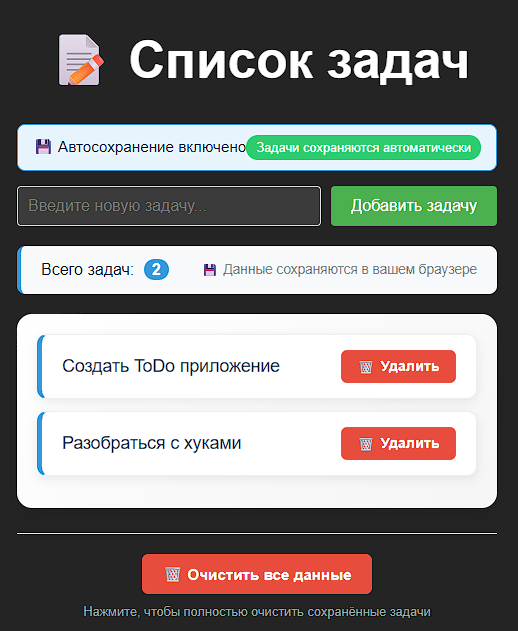

Лабораторная работа №8. Введение в React + JSX

Компонент — это независимая, переиспользуемая часть интерфейса (функция или класс), которая описывает, что показывать на экране.

Пропсы (props) — это данные, которые компонент получает от родителя. Они доступны только для чтения.

Состояние (state) — это изменяемые данные внутри компонента, которые определяют его внешний вид и поведение в текущий момент.

ИИ написал базовое React приложение которе позволяет создавать задачи и удалять их.

В React мы описываем, как должен выглядеть интерфейс для каждого возможного состояния данных. Когда состояние меняется, React автоматически обновляет интерфейс, чтобы он соответствовал новому состоянию. Нам не нужно вручную управлять элементами DOM — React делает это за нас.